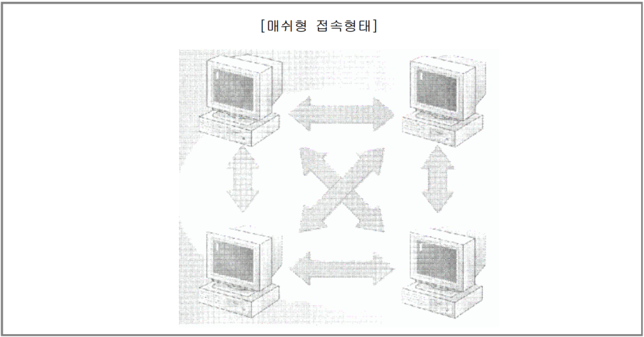
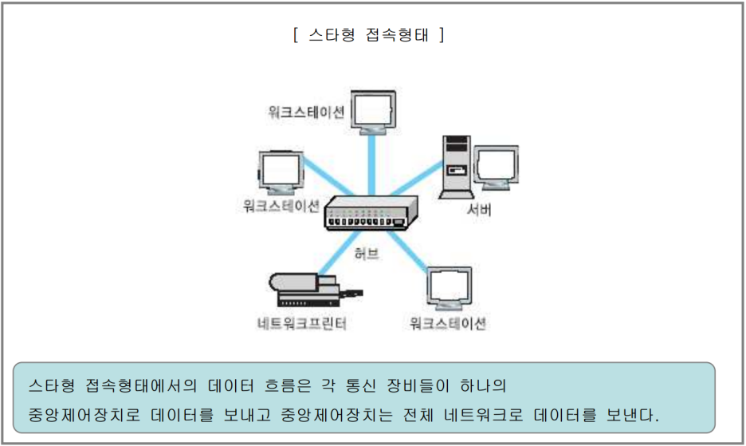
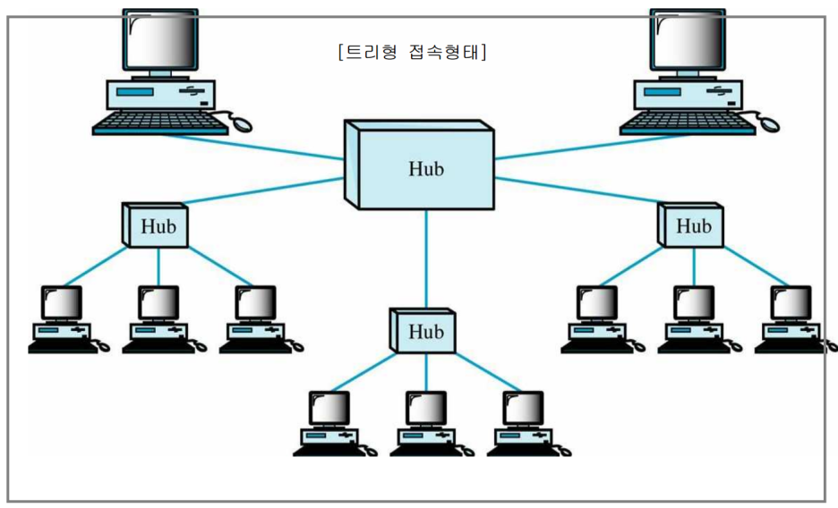
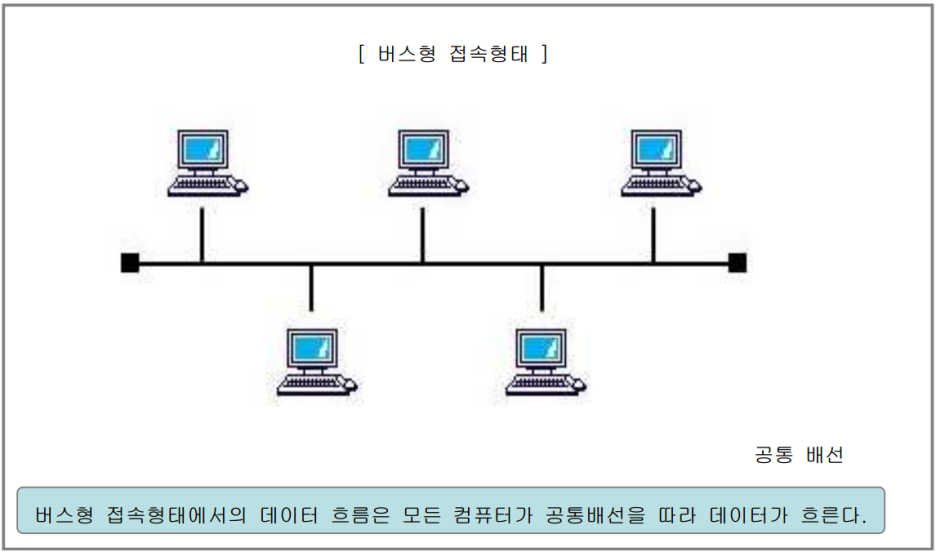
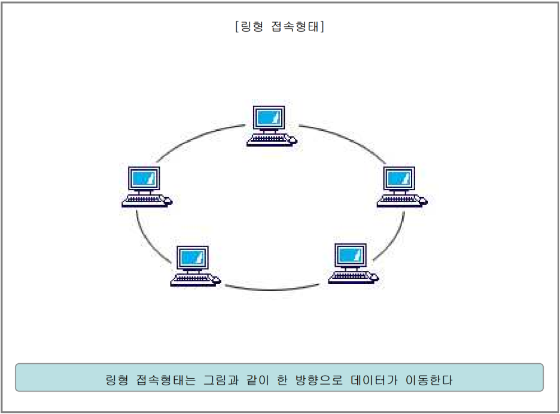
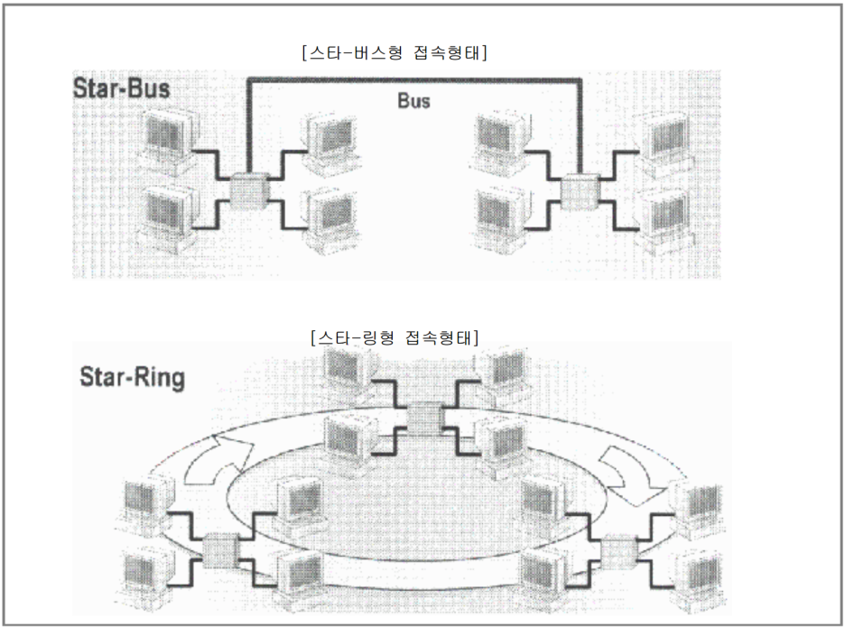

## 네트워크 개요
### 1. 정보통신과 네트워크
#### 정보통신
 - 데이터 : 분석이나 참조를 목적으로 수집한 단순한 자료.
 - 정보 : 특정한 목적을 달성하기 위하여 가공하고 의미를 부여한 데이터.
 - **`정보통신`** : 다수의 통신 수단을 활용하여 `정보`를 필요로 하는 대상과 주고받는 행위.

목표
 - `정확성` : 통신 도중 신호가 약해지거나 외부의 영향을 받아 변형되거나 손실되지 않아야 함.
 - `효율성` : 통신에 사용된 장비나 비용 대비 얻는 정보의 가치가 커야함.
 - `보안` : 통신을 통해 주고 받는 정보가 타인에게 유출되지 않아야 함.

주요 요소
 - `송신자` (Sender) : 정보를 생산하여 보내는 사람이나 장치.
 - `수신자` (Receiver) : 정보를 받아서 처리하는 사람이나 장치.
 - `전송매체` (Medium) : 송신자가 수신자에게 정보를 보낼 때 사용하는 물리적 경로 및 수단.
 - `프로토콜` (Protocol) : 다수의 송신자와 수신자 사이에서 정보통신을 원활하게 하기 위한 상호 간의 규칙.

#### 네트워크
장점
 - 데이터 통신 수단
 - 자원의 공동 소유화
   - 데이터 공유 가능 및 데이터 분산 보관 가능으로 데이터 집중화 완화
 - 업무 환경의 효율화
 - 위험의 분산
---

### 2. 네트워크 토폴로지
 - 목적과 형태에 따른 다양한 설계 방법을 `토폴로지 (Topology)`라 함.

| 이름 | 형태 | 장점 | 단점 |
|------|------|------|------|
| **망형(Mesh)** |    | <ul><li>모든 디바이스가 점대점으로 연결됨.</li> <li>하나의 통신 회선이 고장나도 전체 네트워크에 영향이 없음</li></ul> | <ul><li>모든 디바이스를 연결해야 하므로 공간 및 비용이 많이 듦</li></ul>|
| **성형(Star)** |    | <ul><li>각각의 디바이스가 중앙의 시스템(허브)에 점대점 방식으로 연결됨</li></ul> | <ul><li>중앙 제어 노드 작동 불능 시 전체 네트워크 정지</li></ul>|
| **트리형(Tree)** |    | <ul><li>허브만 있다면 많은 네트워크를 한번에 쉽게 연결 가능</li></ul> | <ul><li>특정 디바이스가 고장나면 해당 계층 이하 디바이스는 작동하지 않음</li></ul>|
| **버스형(Bus)** |    | <ul><li>회선의 양 끝에 `터미네이터(Terminator)`가 시그널의 반사를 방지하기 위해 사용</li></ul> | <ul><li>하나의 통신 회선 안에 너무 많은 디바이스가 연결되면 통신 성능 저하 가능</li><li>통신 회선이 고장나면 전체 네트워크에 영향을 줌</li></ul>|
| **링형(Ring)** |    | <ul><li>양 끝단이 서로 연결되어 있는 링형태를 이룸</li></ul> | <ul><li>버스형과 유사함</li></ul>|
| **하이브리드(Hybrid)** |    | <ul><li>두 가지 이상의 `토폴로지(Topology)`가 혼합되어 사용</li><li>각 토폴로지의 단점을 보완하여 필요에 맞게 구성할 수 있음</li></ul> | |

---
### 3. 네트워크의 다양한 분류

#### A) 통신 방식에 따른 분류
| 이름 | 형태 | 설명 |
|------|------|------|
|**유니캐스트**|  | 1:1 통신 |
|**브로드캐스트**|  | 1:All 통신 |
|**유니캐스트**|  | 1:N(Selected) 통신 |

#### B) 규모와 범위에 따른 분류
 - 근거리 통신망 (LAN) : 집, 학교, 사무실 등
 - 대도시 통신망 (MAN) : 도시 규모 (통상 여러개의 LAN이 연결)
 - 원거리 통신망 (WAN) : 국가나 대륙 (통상 여러개의 MAN이 연결)

#### C) 전송 매체에 따른 분류
ㄱ. 유선 전송 매체
| 이름 | 형태 | 장점 | 단점 |
|------|------|------|------|
|**이중 나선 케이블**| 꼬임선 | <ul><li>저렴</li><li>대중적</li><ul> | <ul><li>고속 전송에 부적합</li><li>외부 신호 간섭에 상대적으로 민감</li></ul> |
|**동축 케이블**| DVI와 유사 | <ul><li>설치가 용이</li><li>큰 대역폭지원으로 많은 데이터를 빠르게 전송 가능</li></ul> | <ul><li>이중 나선 케이블보다 비쌈</li></ul> |
|**광섬유 케이블**| 코어 클래딩 코팅으로 되어있음 | <ul><li>전송하는 빛의 각도를 무한대로 조절하여 한 번에 많은 데이터를 전송할 수 있으며 외부 신호의 간섭을 적게 받음</li><li>전송 손실이 매우 적음</li></ul> | <ul><li>단방향</li><li>구축 비용이 비싸며 매립 설치를 해야함</li></ul> |

ㄴ. 무선 전송 매체
 - 전자파를 매개로 하여 데이터를 전송하는 방식
 - 저주파 : 초당 생성되는 사인파 수가 적음, Frequency가 낮음, 신호 한 번으로 멀리감
 - 고주파 : 초당 생성되는 사인파 수가 많음, Freqeuncy가 많음, 신호 한 번으로 짧게감